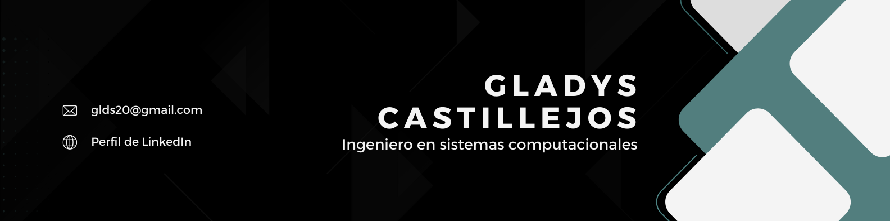

### Hola, Bienvenido a mi perfil 👋

### Acerda de mí
- 👩🏼‍🏫 Actualmente trabajo en UNID formando parte del cuerpo docente. Institución en la que trabajo desde el 2009
- 📚 Actualmente estoy aprendiendo sobre HTML y CSS, así como el manejo del GitHub
- 🤔 Normalmente busco ayuda sobre tecnologías aplicadas a la educación, inteligencia artificial, lenguajes de programación, redes, seguridad informatica y diseño web
- 💬 Si tienes dudas sobre el manejo de aplicaciones ofimaticas como Word, Excel PowerPoint, son gusto puedo ayudarte 😊
  
### Me interesan los siguientes temas:
               

Si tienes alguna sugerencia de algún tema de actualidad o información que apoye mi proceso de aprendizaje, te lo agradecería mucho.

### Contactame a través de...
📧 **gld20@gmail.com**

 
 
 

<!--
**Gladys8/Gladys8** is a ✨ _special_ ✨ repository because its `README.md` (this file) appears on your GitHub profile.

Here are some ideas to get you started:

- 📫 How to reach me: ...
- 😄 Pronouns: ...
- ⚡ Fun fact: ...
-->
